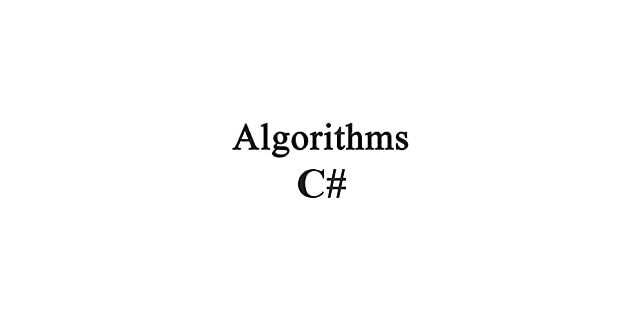

=============
- Verimli algoritmalar O(N log N) zamanda çalışırken verimsiz algoritmalar O(N^2) zamanında çalışır.
- https://www.bigocheatsheet.com/

# Süre Hesaplamaları
- BinarySearch => 14,9443 milisaniye
- BubbleSort => 0,2645 milisaniye
- InsertionSort => 0,2334 milisaniye
- MergeSort => 0,3855 milisaniye
- QuickSort =>  0,2273 milisaniye
- EratosthenesKalburu => 15,1473 milisaniye

# Kaynaklar
- https://www.mobilhanem.com/algoritma-egitimleri/
- https://bilgisayarkavramlari.com/2008/08/09/birlestirme-siralamasi-merge-sort/
- https://www.hackerrank.com/
